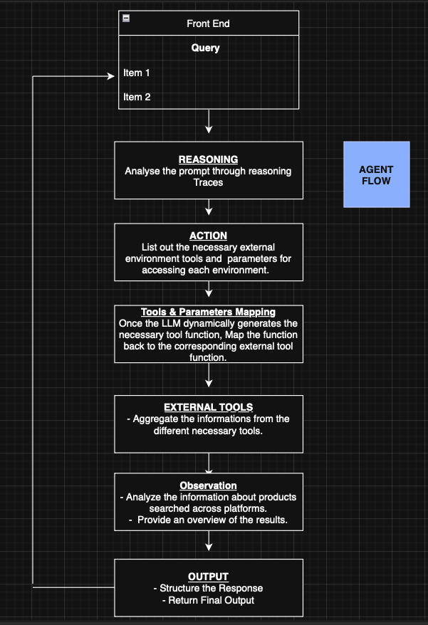
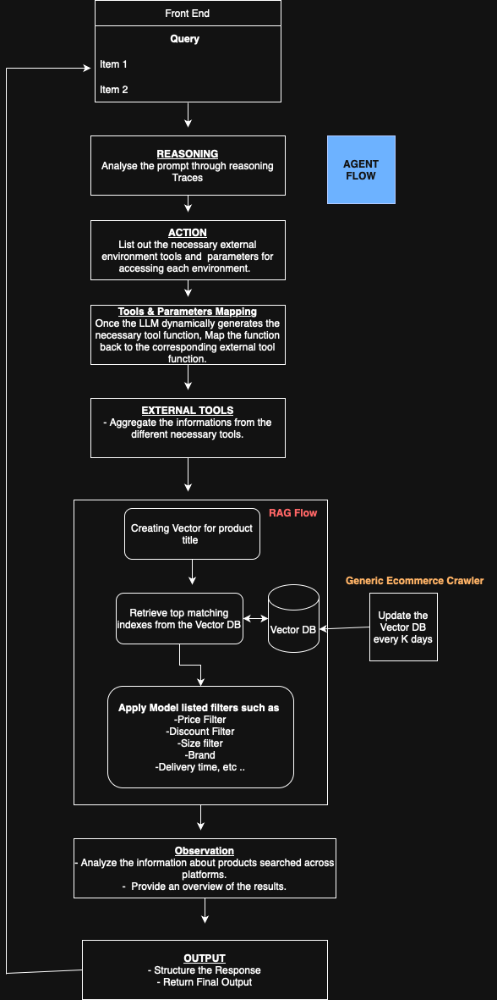

# ReACT Method Based E-commerce Agent

This repository contains code that enables searching for products across various platforms (such as Amazon and Walmart) using a custom agentic framework. The tools provided can search for products, check discount coupons, filter products based on a specified price threshold, estimate shipping times, and more.

## Table of Contents

- [About the Code Flow](#about-the-code-flow)
- [Modules Explanation](#modules-explanation)
- [External Environments](#external-environments)
- [Flow Explanation](#flow-explanation)
- [Future Development](#future-development)
- [Setup Details](#setup-details)

## About the Code Flow

The project is structured into several modules that work together to process user queries, interact with external APIs, and return results in a standardized JSON format.

## Modules Explanation

- **Agent.py**: Contains the ReACT prompt-based agent.
- **app.py**: Implements a minimal front-end using Streamlit.
- **Tool.py**: Defines the necessary external environment tools.
- **prompt.py**: Contains the ReACT-based prompt templates.
- **template.py**: Provides standard JSON template formats for output.
- **.env**: Stores API credentials.

## External Environments

### Tool: `search_products`
- **Arguments:** product name, brand, size, color  
- **Description:** Fetches products asynchronously across platforms (currently supports Amazon and Walmart) using RapidAPI.  
- **Future Development:**  
  Some filters (e.g., size and color) are not working correctly on platforms like Amazon. A solution needs to be devised to address these issues.

### Tool: `check_discount`
- **Arguments:** coupon code  
- **Description:** Checks coupon validity asynchronously across platforms (or on a specified platform). If valid, it returns the product with the discounted price.  
- **Future Development:**  
  Since RapidAPI does not provide coupon information, this tool currently uses real-time logic to randomly accept or reject a coupon code. Future work will focus on integrating a reliable API for coupon validation.

### Tool: `price_filter`
- **Arguments:** maximum price  
- **Description:** Filters products asynchronously based on a given price range.

### Tool: `check_shipping_time`
- **Arguments:** expected shipping date  
- **Description:** Filters products that can ship before the specified date asynchronously.  
- **Future Work:**  
  Due to limited access to shipping information (e.g., on Walmart), the tool currently simulates shipping times by generating random values. Future updates will aim to use accurate shipping data.

### Tool: `check_return_policy`
- **Description:** Filters products based on whether they offer a return policy asynchronously.  
- **Future Work:**  
  As access to return policy information is currently limited (e.g., on Walmart), the tool assumes all products have a return policy. Future enhancements will focus on fetching and filtering based on actual return policy details.

### Tool: `price_comparison`
- **Arguments:** product price to compare, product name, platform  
- **Description:** Fetches product information from all platforms (except the one where the user made the initial purchase) and analyzes the price range. It returns the minimum and maximum prices of the product across different platforms.

## Flow Diagram



## Flow Explanation

Once the Streamlit UI is live, the user can submit a query. The process follows these steps:

1. **LLM Analysis:**  
   The agent analyzes the user query using a language model (e.g., GPT-4o-mini), employing reasoning traces to understand the query.
2. **Actions:**  
   Based on the analysis, the agent determines which external tools to invoke and identifies the necessary arguments for each tool.
3. **Mapper:**  
   The dynamically generated functions from the language model are mapped back to the corresponding external tool functions.
4. **Aggregation:**  
   Information from various platforms is aggregated using the selected tools. The final response is then returned in JSON format.

## Future Development

- **Coupon Validation:** Integrate a reliable API for check realtime coupon validation to replace the current random acceptance/rejection logic.
- **In-House Model:** Since this repository depends on OpenAI models, in the future, I can fine-tune the open-sourced model using the reasoning traces from large models such as GPT-4o by applying ReSET training logic iteratively with synthetic data.
- **Crawler & RAG for E-commerce  :** This flow retrieves product information directly from platforms like Amazon and Walmart via APIs, limiting search efficiency, scalability, and inference. To address this, we need to develop an e-commerce crawler that scrapes product data across platforms and stores it in a scalable vector database. The database should include both visual (product images) and textual (product names) embeddings, enabling product searches using either product details or titles.

## Future Architecture

## Setup Details

Follow these steps to set up the project on your instance:

### 1. Clone the Repository

```bash
git clone git@github.com:sukeshan/ShopReACTAgent.git
```

## 2. Navigate to the Project Directory and Install Dependencies  

```
cd ShopReACTAgent
pip install -r Requirements.txt
```

## 3. Create a .env File and Add API Credentials 

 Create a .env file in the root of the project and add the following lines:  

```
RAPID_API_KEY=<API KEY>

OPENAI_API_KEY=<API KEY>
 ```

## 4. Run the Application

```streamlit run app.py```

## Refered Research Papers
- [Chain-of-Thought Prompting Elicits Reasoning in Large Language Models](https://arxiv.org/abs/2201.11903)
- [ReAct: Synergizing Reasoning and Acting in Language Models](https://arxiv.org/abs/2210.03629)
- [Sample-Efficient and Safe Deep Reinforcement Learning via Reset Deep Ensemble Agents](https://arxiv.org/abs/2310.20287)
- [ReST meets ReAct: Self-Improvement for Multi-Step Reasoning LLM Agent](https://arxiv.org/abs/2312.10003)
- [Toolformer: Language Models Can Teach Themselves to Use Tools](https://arxiv.org/abs/2302.04761)

